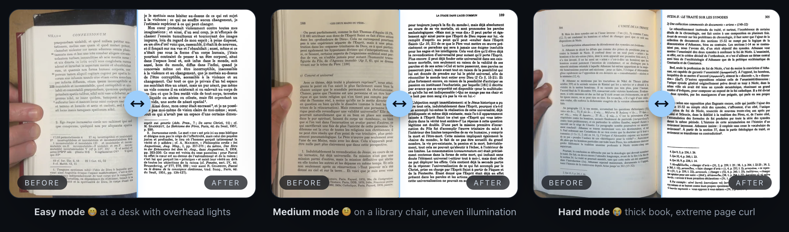
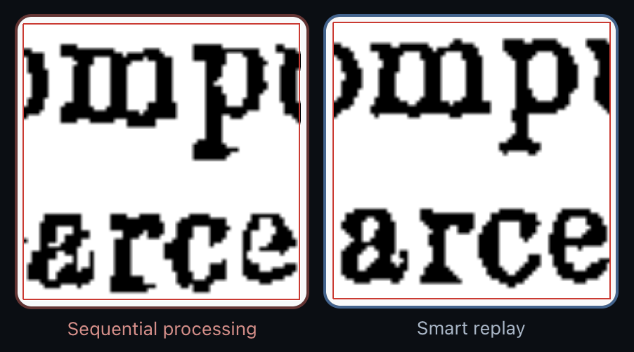

<a id="readme-top"></a>

<!-- PROJECT SHIELDS -->
[![Release][release-shield]][release-url]
[![CI][ci-shield]][ci-url]
[![Issues][issues-shield]][issues-url]
[![Python 3.12][python-shield]][python-url]
[![Platforms][platforms-shield]][release-url]
[![Made in France][france-shield]][france-url]
[![License: PolyForm Shield][license-shield]][license-url]

<!-- PROJECT HEADER -->
<br />
<div align="center">
  <h1 align="center">Aglaïa</h1>

  <p align="center">
    Turn a webcam and a stack of pages into clean, deskewed, dewarped,
    searchable PDFs — locally, on your machine.
    <br />
    <a href="https://aglaia.bibli.cc/docs"><strong>Explore the docs »</strong></a>
    <br />
    <br />
    <a href="https://aglaia.bibli.cc">Website</a>
    ·
    <a href="https://github.com/yb85/aglaia/releases/latest">Download</a>
    ·
    <a href="https://github.com/yb85/aglaia/issues/new?labels=bug">Report Bug</a>
    ·
    <a href="https://github.com/yb85/aglaia/issues/new?labels=enhancement">Request Feature</a>
  </p>
</div>

<!-- TABLE OF CONTENTS -->
<details>
  <summary>Table of Contents</summary>
  <ol>
    <li>
      <a href="#about-the-project">About The Project</a>
      <ul><li><a href="#built-with">Built With</a></li></ul>
    </li>
    <li>
      <a href="#getting-started">Getting Started</a>
      <ul>
        <li><a href="#download">Download</a></li>
        <li><a href="#install-from-the-command-line">Install from the command line</a></li>
      </ul>
    </li>
    <li><a href="#usage">Usage</a></li>
    <li><a href="#how-it-works">How It Works</a></li>
    <li><a href="#roadmap">Roadmap</a></li>
    <li><a href="#contributing">Contributing</a></li>
    <li><a href="#license">License</a></li>
    <li><a href="#contact">Contact</a></li>
    <li><a href="#acknowledgments">Acknowledgments</a></li>
  </ol>
</details>

<!-- ABOUT THE PROJECT -->
## About The Project

The goal of this project is to provide a simple, comprehensive, extendable, tool for end-to-end book scanning.

Book scanning is usually done using custom rigs — *eg* [Custom rigs on diybookscanner.org](https://www.diybookscanner.org/en/designs.html)

This is a fine way of doing things which has many advantages : you control the perspective, the geometry, the illumination, …
**BUT** it is not portable and requires a quite substancial time and resources investment.

At the other end of the spectrum you have ugly phone pictures, and a myriad of "Free Scanner" aps on the iOS appStore which all repackage the simple homography and detection primitives of the Apple Vision SDK : if you are not scanning flat sheets of paper you are out of luck 

**Aglaia** wants to do the following : **Provide a comprehensive solution to book scanning**, *ie* allow to use **physical books** and **the tools you have** (a laptop and a phone, maybe a camera) **in any situation** you could be (at your desk, on bench outside, at the libray…) to produce **high-quality digital materials** suitable for :
- archiving, indexing and printing : **clean, OCRed PDFs**
- feeding knowledgebases and AI research tools : **well structured Markdown files**

The slider section on the project website demonstrates this purpose :



**Aglaïa**'s purpose is similar to **Scantailor**'s, but it tries to reduce the friction with better import (images, pdf or capture), exports (pdf with OCR, markdown, ...), built-in OCR, extendability through custom pipelines, exporters and plugins and more modern algorithms. 

### What the default pipeline will do to a standard book ?

In a few word Aglaïa will produce precisely cut binarized text pages with perspective and page curvature correction. On a modern laptop it can process rougly 2 scans per second.

To achieve it, it relies on :

- a coarse scan-based deskewing followed  by a robust and precise page extraction using lightweight ML text recognition models
- a finer page based deskewing followed by a robust binarization which can tolerate very unequal illumination and handle border constraints
- keystone and page curvature correction. This is the most computationally demanding part, handed out to JAX/CUDA or JAX/MLX libraries if available
- a final replay to intelligently compose the coordinate and morphological transforms to avoid successive interpolation artifacts, especially severe on bilevel images




> [!NOTE]
> **Cross-platform.** Native GUI builds ship for **macOS** (signed/notarized
> DMG, Apple Silicon), **Windows** (installer) and **Linux** (AppImage), plus
> `pip install aglaia` on any platform. On macOS, Apple Vision powers page
> detection and on-device OCR; off macOS, Aglaïa falls back to EAST/DBnet for
> layout and to Surya / PaddleOCR-VL / Mistral for OCR. Voice control (Vosk)
> is offline and cross-platform.

<p align="right">(<a href="#readme-top">back to top</a>)</p>

### How much does it costs ?

It's free. [Donations are appreciated](https://ko-fi.com/yb_85) to help cover developpement costs (signing and notarization, AI coding tool)


### Built With

* [![Python][python-shield]][python-url] managed with [uv](https://docs.astral.sh/uv/)
* **PySide6** — cross-platform desktop GUI
* **OpenCV · NumPy · SciPy · Pillow** — image processing
* **page-dewarp + JAX / MLX** — cubic-sheet page dewarp (MLX on Apple Silicon). The original project has been highly modified and extended
* **doxapy** — binarization (Wolf / Sauvola)
* **pikepdf · pypdfium2** — PDF I/O
* **Apple Vision · Speech** (pyobjc, macOS) — OCR, layout, with EAST/DBnet fallbacks
* **Surya · PaddleOCR-VL · Mistral Document AI** — cross-platform OCR engines
* **Vosk** — offline voice control (cross-platform)
* **SQLite (FTS5)** — project + full-text store

<p align="right">(<a href="#readme-top">back to top</a>)</p>

<!-- GETTING STARTED -->
## Getting Started

### Download

Grab the latest build for your platform — the release CI publishes
fixed-name "latest" artifacts, so these links never go stale:

| Platform | Download | Notes |
|---|---|---|
| **macOS** (Apple Silicon) | [`Aglaia-macos-arm64.dmg`](https://github.com/yb85/aglaia/releases/latest/download/Aglaia-macos-arm64.dmg) | Signed + notarized. Open and drag to Applications. |
| **Windows** (x64) | [`Aglaia-windows-x64-setup.exe`](https://github.com/yb85/aglaia/releases/latest/download/Aglaia-windows-x64-setup.exe) | Installer; registers the `.agl` file type. |
| **Linux** (x86_64) | [`Aglaia-x86_64.AppImage`](https://github.com/yb85/aglaia/releases/latest/download/Aglaia-x86_64.AppImage) | `chmod +x`, then run. Needs FUSE (`fuse2`). |

### Install from the command line

CLI-only or scripted setups (any platform) install via **uv** or **pip**:

```sh
# from PyPI — installs the `aglaia` command
pip install aglaia                  # lean base: headless pipeline, no Qt
pip install "aglaia[gui]"           # Windows / Linux GUI (Qt)
pip install "aglaia[gui,macos]"     # macOS GUI: Vision, Speech, MLX dewarp
```

```sh
# or build from source with the extras you want
git clone https://github.com/yb85/aglaia.git && cd aglaia
uv sync --extra gui --extra macos   # macOS GUI
uv sync --extra gui                 # Windows / Linux GUI
uv sync                             # headless: CLI pipeline, no Qt
```

Optional extras: `--extra surya` / `--extra paddle` (OCR engines),
`--extra voice` (Vosk), `--extra cloud` (Mistral), `--extra cuda` (NVIDIA
GPU dewarp on Linux).

#[!WARNING] Build with the right options
# The `--extra` options are mandatory to interface models and backends with python. If you download the models or install cuda drivers on your computer but forget to include teh relevant extra options, they won't be used
#

<p align="right">(<a href="#readme-top">back to top</a>)</p>

<!-- USAGE -->
## Usage

```sh
# Capture GUI (webcam + processing chain + voice control)
uv run aglaia ~/scans/my-book        # or just `aglaia …` once installed

# Headless CLI batch — same chain, no Qt
uv run aglaia ~/scans/my-book.agl --headless -p aglaia/config/pipelines/book_curved_x2.yaml
```

Key flags: `-c/--config`, `-p/--pipeline`, `--workers`, `--export`,
`--do-ocr`, `--input-dpi`, `--headless`, `--camera-id`. The import panel
accepts multiple images and PDFs (per-page extract or render). Drop
EAST / PP-OCR models into `./model/` or `./models/` (or fetch them from the
in-app downloader).

_For the full guide, see the [documentation](https://aglaia.bibli.cc/docs)._

<p align="right">(<a href="#readme-top">back to top</a>)</p>

<!-- HOW IT WORKS -->
## How It Works

```
capture → DPI fix → deskew → layout detect → keystone → dewarp → binarize → OCR → export
```

Every step is a pluggable processor defined in a YAML pipeline. Add your
own by dropping `aglaia/processors/<NewProc>.py` (the registry auto-discovers
it) — or, at runtime, drop a `.py` into `<APP_DATA>/plugins/` and approve
it in the trust prompt. See
[Architecture](https://aglaia.bibli.cc/docs/reference/architecture) and
[Processors](https://aglaia.bibli.cc/docs/reference/processors).

<p align="right">(<a href="#readme-top">back to top</a>)</p>

<!-- CONTRIBUTING -->
## Contributing

Work is tracked via GitHub issues + milestones — one issue per discrete
unit of work. Before non-trivial work, open an issue. Branch names
reference it (`feat/123-slug`); PRs close via `Closes #N`.

1. Fork the project
2. Create your branch (`git checkout -b feat/123-amazing-feature`)
3. Make changes; keep `ruff`, `mypy --strict`, and `pytest` green
4. Commit (`git commit -m 'feat: add amazing feature'`)
5. Push and open a Pull Request

<p align="right">(<a href="#readme-top">back to top</a>)</p>

<!-- LICENSE -->
## License

Source-available under the **[PolyForm Shield License 1.0.0](https://polyformproject.org/licenses/shield/1.0.0/)**
— see [`LICENSE`](LICENSE).

#[!WARNING] This is not strictly-speaking "open-source" !
#
# the reason is not to make it one day a commercial product, but to avoid trivial SaaS repackaging which hurts the developpment of free Apps.
#

You may use, modify, and redistribute the software for **any purpose
except building a product that competes with it**. Otherwise free.

Repackaging it and removing the donation link is direct competition.

<p align="right">(<a href="#readme-top">back to top</a>)</p>

<!-- CONTACT -->
## Contact

aglaia@bibli.cc

Project: [github.com/yb85/aglaia](https://github.com/yb85/aglaia) ·
Website: [aglaia.bibli.cc](https://aglaia.bibli.cc)

<p align="right">(<a href="#readme-top">back to top</a>)</p>

<!-- ACKNOWLEDGMENTS -->
## Acknowledgments

See [ABOUT page](./ABOUT.md).

<p align="right">(<a href="#readme-top">back to top</a>)</p>

<!-- MARKDOWN LINKS & IMAGES -->
[release-shield]: https://img.shields.io/github/v/release/yb85/aglaia?style=for-the-badge
[release-url]: https://github.com/yb85/aglaia/releases/latest
[ci-shield]: https://img.shields.io/github/actions/workflow/status/yb85/aglaia/ci.yml?style=for-the-badge&label=CI
[ci-url]: https://github.com/yb85/aglaia/actions/workflows/ci.yml
[issues-shield]: https://img.shields.io/github/issues/yb85/aglaia?style=for-the-badge
[issues-url]: https://github.com/yb85/aglaia/issues
[python-shield]: https://img.shields.io/badge/python-3.12-3776AB?style=for-the-badge&logo=python&logoColor=white
[python-url]: https://www.python.org/
[platforms-shield]: https://img.shields.io/badge/macOS%20%C2%B7%20Windows%20%C2%B7%20Linux-555?style=for-the-badge
[france-shield]: https://img.shields.io/badge/Made%20in-France%20%F0%9F%87%AB%F0%9F%87%B7-777?style=for-the-badge
[france-url]: https://github.com/yb85/aglaia
[license-shield]: https://img.shields.io/badge/license-PolyForm%20Shield%201.0.0-orange?style=for-the-badge
[license-url]: https://polyformproject.org/licenses/shield/1.0.0/
