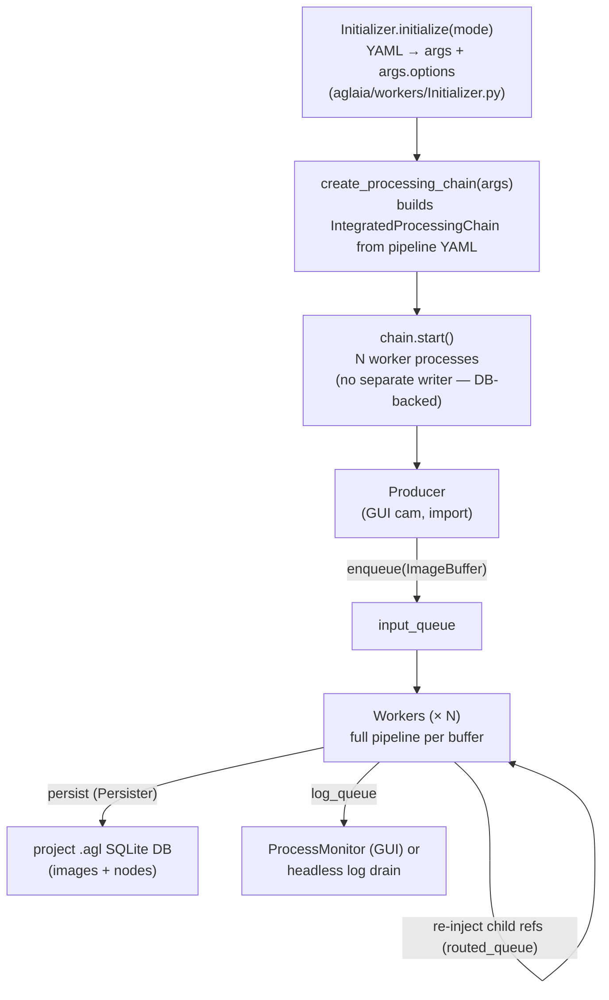
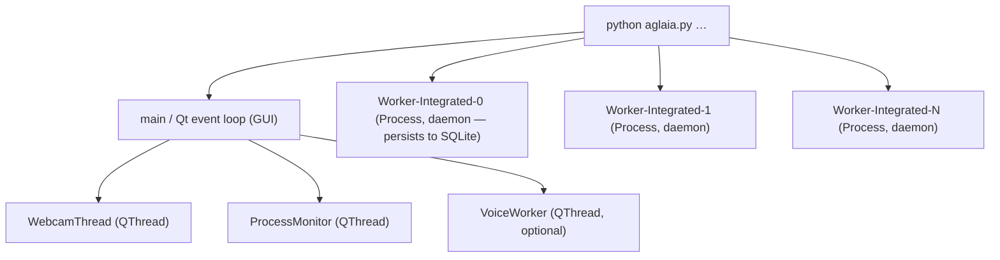
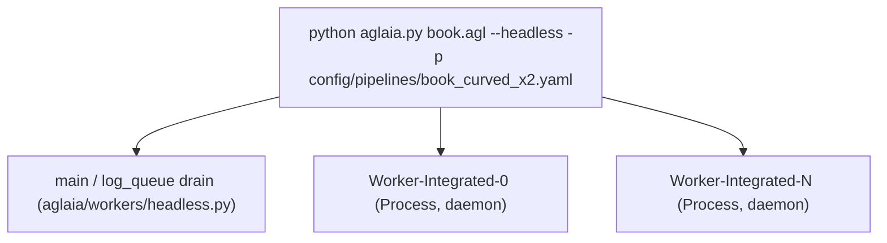

# Architecture

## Terminology

Three user-facing nouns, each backed by one storage table:

| Term | What it is | Table |
|---|---|---|
| **scan** | one whole captured / imported picture | `scans` |
| **page** | one page-detector output within a scan (a column / region); a scan with no split still has exactly one page | `branches` |
| **stage** | one pipeline-step output for a page (DPI-fix, deskew, dewarp, binarize, OCR, …) | `nodes` |

A scan contains one or more **pages**; each page is a chain of **stages**.
`docs/storage.md` documents the raw schema and uses the table names
(`scans` / `branches` / `nodes`) directly.

## High-level

Both entry scripts share the same structure:



> Workers write image blobs + node rows straight into the project's SQLite
> `.agl` DB through an in-worker `Persister` — there is no separate writer
> process and nothing lands as loose files on disk. Branch children are
> re-injected onto `routed_queue` as ~100-byte DB references (`node_id`,
> `start_idx`, `branch_path`), not pixel pickles.

`multiprocessing.set_start_method("spawn", force=True)` — required for pyobjc / TensorFlow on macOS and forces everything queued to be picklable.

## Components

### Initializer (`aglaia/workers/Initializer.py`)

- `initialize(mode)` — `mode` is `"capture"` or `"pdf"`. Builds `args` with merged defaults and CLI overrides. Populates `args.options` (dict structure used by GUI/workers) and `args.config` (keybindings, voice, paths, calibration scaffolding).
- `create_processing_chain(args, log_queue, queue_factory=multiprocessing.Queue, find_page_numbers=True)` — loads pipeline YAML at `args.pipeline` (default `config/pipelines/book_curved_x2.yaml`), instantiates option dataclasses, applies CLI overrides (debug, max_pages, camera_matrix injection for PageDewarper), returns an `IntegratedProcessingChain`.
- `load_pipeline_def(path)` — YAML loader with template substitution. Strings starting with `t:` become `TemplateEvaluator(rest)` so they can be evaluated lazily with image context (`$dpi`, `$x`, `$y`, `$type`). `TemplateEvaluator` is a picklable callable; lambdas can't cross process boundaries.
- Option dataclasses for each YAML `options:` block come from the processor registry (`aglaia/processors/registry.py:option_classes()`) — auto-discovered, not a hand-maintained map.

### IntegratedProcessingChain (`aglaia/workers/IntegratedProcessingChain.py`)

- Each worker process holds **all** processor instances and runs the entire pipeline sequentially per `ImageBuffer`. No inter-stage queues.
- Persistence is **in-worker**: each worker opens the project SQLite DB and writes every stage's image blob + `nodes` row through a `Persister` (`aglaia/storage/persister.py`). There is no separate writer process and no loose files on disk — everything lives in the `.agl` DB.
- Branching (when `PageDetector` produces child crops) persists each child, then re-injects it onto `routed_queue` as a small DB reference `('ref', {node_id, start_idx, branch_path, scan_id, parent_stem})` so any free worker resumes it mid-pipeline. A ~100-byte tuple replaces a multi-MB pixel pickle through the manager.
- When a page split makes the parent obsolete, the parent **node** is pruned from the visible output (DB-level), not a file deleted.
- Terminal nodes register a row in `branches` (`upsert`); per-page visibility is `branches.trashed_at` (NULL = visible).

### Workers

```
while True:
    # routed_queue (branch children) drains first, then fresh producer input
    item = routed_queue.get_nowait() or input_queue.get(timeout=0.5)
    if item is None: break
    if item[0] == 'ref':                 # branch child — rebuild from the DB
        ref = item[1]
        buf, start_idx = load_ref(ref), ref['start_idx']
    else:                                # fresh ImageBuffer from a producer
        buf, start_idx = item, 0
    run_pipeline(buf, start_idx)
```

(`load_ref` reads the persisted node + image blob back into an
`ImageBuffer`, so the queue only ever carries a ~100-byte reference.)

`run_pipeline` walks `processors[start_idx:]`, calling `processor.run(buffer)` (which wraps `process()` and validates the output shape). Behaviors:

- A processor may return `None` → branch stops with a warning.
- A processor may return a list of buffers, or set `result.children` → each child is persisted, then re-injected on `routed_queue` as `('ref', {node_id, start_idx: i+1, branch_path, scan_id, parent_stem})`. The parent node is pruned from the visible output at the DB level (no file deletion).
- If the previous buffer was BW, downstream non-binarizing steps re-binarize their result with `binarize_fixed(127)` to preserve BW.
- Per-step timings are sent to `log_queue` as `('timing', stem, dims, dpi, proc_name, ms, success)`.
- When a branch reaches its end, a **replay pass** (`aglaia/workers/Replay.py`) recomputes the final image from the nearest persisted upstream image: it reorders steps by their `REPLAY_TRAIT` (compose `COORDINATE` warps into one remap, apply `PIXEL_VALUE` ops last, treat `ROI` steps as fixed anchors) so the output takes the minimum number of interpolations. See [pipeline.md](pipeline.md) → Replay pass.

### log_queue protocol

All inter-process communication that isn't an image goes through `log_queue`. Tuple shapes:

| Tag | Tuple |
|---|---|
| `log_info` | `('log_info', msg)` |
| `log_warning` | `('log_warning', msg)` |
| `error` | `('error', msg)` |
| `worker_started` | `('worker_started', source_name)` |
| `image_event` | `('image_event', {scan_id, node_id, parent_node_id, image_id, branch_id, event_type, filestem, depth, branch_path, branch_label, meta})` |
| `branch_ready` | `('branch_ready', {scan_id, branch_id, branch_path, chosen_node_id})` |
| `timing` | `('timing', filestem, "WxH", dpi, proc_name, ms, success)` |

In the GUI, `ProcessMonitor` (`aglaia/workers/ProcessMonitor.py`) drains the queue and re-emits them as Qt signals on the main thread.

`image_event` is the primary signal the GUI listens to — it's a **dict** carrying DB row ids (`node_id` / `image_id` / `scan_id`), not file paths, since the image was already persisted. `event_type` is the step's `instance_name` (e.g. `03_pages_2ppf`). `branch_ready` fires when a page's pipeline finishes and its `branches` row is registered.

### Producers

- **GUI (`aglaia.py`)**: `MainWindow.capture()` reads a frame from `WebcamThread`, applies undistortion if a calibration exists, builds an `ImageBuffer`, and `processing_queue.put(img_buf)`.
- **Imports (GUI import panel / `--headless`)**: `aglaia/workers/ImportHelpers.py` (`enqueue_pdf_files` / `enqueue_image_files`) extracts or renders pages via `PDFprocessor`, wraps each in an `ImageBuffer`, and feeds the same chain.

## Process tree at runtime

Capture mode:



(No separate writer process — each worker persists to the project DB directly.)

Headless mode (`aglaia.py … --headless`):



## Shutdown

- GUI: `closeEvent` stops `WebcamThread`, `ProcessMonitor`, `VoiceWorker`, then `chain.stop()` terminates worker processes.
- Headless: `_wait_for_chain` drains until every expected `branch_ready` arrives (or timeout), then `chain.stop()`.
- `SIGTERM` is hooked to raise `KeyboardInterrupt` for clean shutdown.
