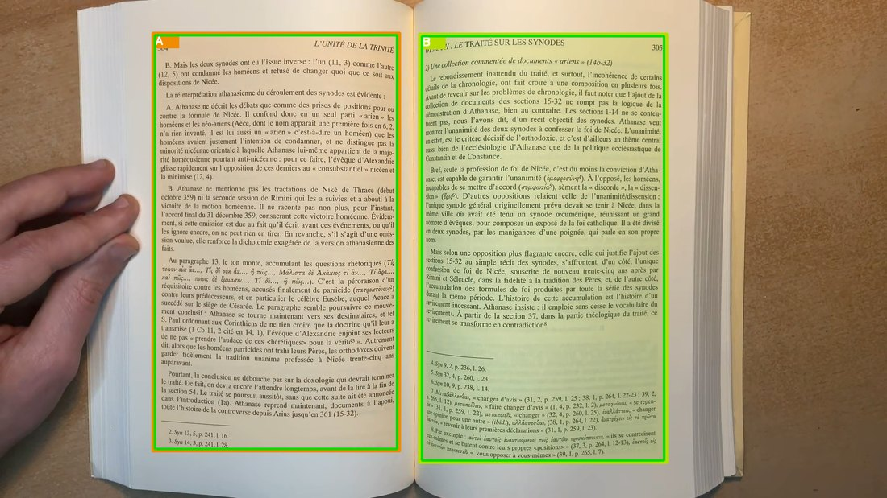
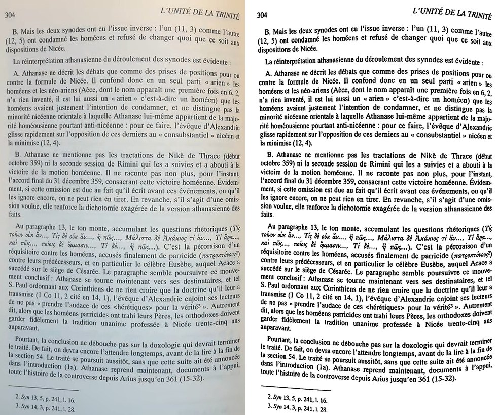
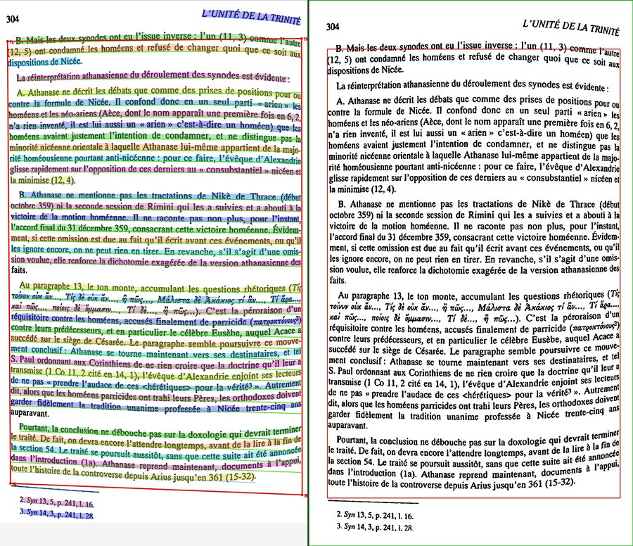
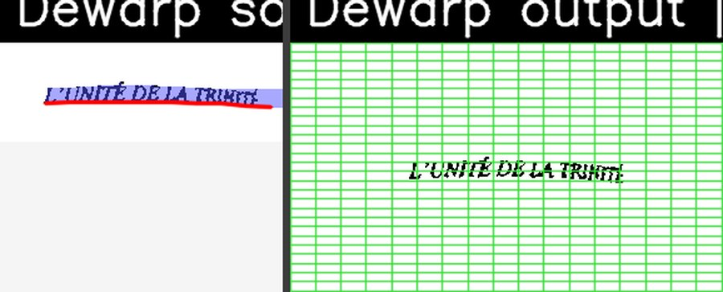

# Processors

All processors live in `lib/processors/`. Each has:

- A `*Option` dataclass extending `AbstractProcessorOption` (`lib/processors/abstraction.py`).
- A class extending `AbstractImageProcessor`.

## Processor contract (`AbstractImageProcessor`)

| Member | Required | Purpose |
|---|---|---|
| `SUMMARY: str` | yes (UI-exposed) | One-liner for the add-step menu. |
| `OPTIONS: dict[str, ParamSpec]` | yes (UI-exposed) | Option specs; the registry's discovery gate. |
| `REPLAY_TRAIT: ReplayTrait` | for replayable steps | `COORDINATE` / `PIXEL_VALUE` / `ROI` — drives the replay engine (see [pipeline.md](pipeline.md) → Replay pass). Also gates **per-page disable**: only COORDINATE/PIXEL_VALUE steps are toggleable; ROI / branch-emitting steps (e.g. PageDetector) are locked because skipping them would restructure the branch tree. A disabled step is bypassed with a passthrough node (see [storage.md](storage.md#per-page-processor-disable-step_overrides)). |
| `process(buffer) -> ImageBuffer \| list[ImageBuffer] \| None` | yes | The transform. Mutate `buffer` and return it; return a list (or set `buffer.children`) to branch; return `None` to stop the branch. |
| `replay(buffer)` | no | End-of-chain reconstruction. Default re-runs `process()`; geometric processors stamp `replay_kind`/`replay_params` so the engine fuses their warp instead. |
| `OPTION_CLASS` | no | Explicit options dataclass; default is synthesised from `OPTIONS`. |
| `REGISTRY_NAME` | no | Registry key; default is the class name. |

The chain calls `run(buffer)`, which wraps `process()` and enforces the
output-format contract (`ImageBuffer`, list, or `None`). `__init_subclass__`
validates the contract at import (warns on a missing `SUMMARY`, or `OPTIONS`
keys with no matching option field).

### Common option fields

`AbstractProcessorOption` contributes only plumbing fields every processor
inherits: `debug` (bool), `debug_dir` (str?), `timeout_s` (float). They are
hidden from the parameter descriptions.

## DPIfixer (`lib/processors/DPIfixer.py`)

Clamp `ImageBuffer.dpi` into `[min_dpi, max_dpi]` via `cv2.resize`. `INTER_CUBIC` for upsampling, `INTER_AREA` for downsampling. Updates `meta["roi"]` (point coords scaled). No-op if change <1 dpi.

```yaml
options:
  min_dpi: 100
  max_dpi: 300
```

Use it both as **input clamp** (early) and **normalize** (e.g. force exactly 300dpi by setting both bounds equal).

## SkewFinder (`lib/processors/SkewFinder.py`)

Two-pass projection-profile deskew:

1. Downscale to 400px tall, then binarize (Otsu) — estimation only; the output buffer is untouched by this downscale.
2. Coarse search: ±`max_angle` in 1° steps. Score = `sum(diff(row_sums)^2)` on a sheared copy (rows align when angle matches).
3. Fine search: ±1° around best angle in `accuracy` steps.
4. If `apply_rotation` and `|angle| ≥ min_angle`, rotate via `cv2.warpAffine`. Border value = white for color, configurable via `k_cluster`.

Stored as `meta["skew"]`. `meta["roi"]` polygon is transformed by the same matrix.

```yaml
options:
  max_angle: 30.0      # Search range in degrees
  min_angle: 0.1       # Minimum angle to actually apply rotation
  accuracy: 0.1        # Fine-search step
  apply_rotation: true
  k_cluster: 0         # 0 = white background. >1 = k-means cluster count for bg color detection
```

`estimate_skew(image)` is a module-level helper used by `ImageBuffer.deskew`.

## LayoutBackend (text detection)

`lib/processors/layout_backends/` — pluggable abstraction picked via the `backend:` YAML option on `PageDetector`.

| Backend | Model | GPU |
|---|---|---|
| `apple_vision` | macOS Vision framework | Neural Engine / GPU automatic |
| `east` | `frozen_east_text_detection.pb` (~95 MB) in `./model/` or `./models/` | CUDA via `cv2.dnn` if OpenCV is CUDA-built |
| `dbnet` | PP-OCR det ONNX (v3/v4/v5) in `./model/` or `./models/` | same as above |
| `heuristic` | none | CPU only |
| `auto` | macOS: apple_vision → east → dbnet → heuristic. Linux/Windows: east → dbnet → heuristic. | inherits |

Each backend reports `uses_gpu`. The chain stamps `meta['gpu'] = True` on every node produced by a GPU-backed processor; the web UI then renders a 🚀 next to the step in the per-scan timing bar.

## PageDetector (`lib/processors/PageDetector.py`)

Apple Vision text detection → merge overlapping x-spans → optional reduce-to-N → emit child buffers.



1. Optionally downscale to `processing_dpi` for detection (defaults to no downscale).
2. The configured `LayoutBackend` (`auto` → `apple_vision` on macOS) `.detect(img)` returns bounding boxes.
3. `smart_merge(boxes)` merges horizontally overlapping / close boxes into column groups, scored by the `merge_*` weights.
4. If `max_pages > 0` and result count exceeds it, the `over_cap` strategy reduces the surplus: `"merge"` folds the best-scoring pair together (default), while `"discard"` drops the smallest page. Single-page modes (`sheet`, `book_flat_x1`) use `over_cap: discard` so marginal text bleeding in from a facing page is thrown away rather than merged into the kept page. Genuine over-splits scoring ≥ `merge_threshold` always merge regardless of strategy.
5. For each page, crop the original image with `margin_mm` margin, build a child `ImageBuffer`. Intersect the parent's `meta["roi"]` polygon with the crop rect via `cv2.intersectConvexConvex` and propagate the result.
7. Returns `input_buf.children` (list of buffers). The chain re-injects each child into the pipeline starting at the next step and prunes the parent file from output.

```yaml
options:
  margin_mm: 2.0           # crop margin around each page bbox
  roi_margin_mm: 1.0       # tighter ROI margin propagated downstream (≤ margin_mm)
  max_pages: 2           # 0 = infinity
  over_cap: merge          # over-cap reduction: merge | discard (drop smallest)
  processing_dpi: 150.0    # null = no downscale
  rescale_threshold: 0.01
  merge_threshold: 0.60    # column-merge score cutoff
  merge_gap_weight: 0.4    # gap term weight in the merge score
  merge_width_weight: 0.6  # width-similarity term weight
  merge_gap_norm_cap: 0.15 # cap on the normalized inter-box gap
```

**Requires macOS + Apple Vision** (the `apple_vision` backend). If the Vision backend is unavailable, `auto` falls back to EAST → DBnet → heuristic.

## Binarizer (`lib/processors/Binarizer.py`)



Local adaptive thresholds (Wolf/Sauvola/…) compute a per-window cutoff, so a
shadow or lighting gradient across the page doesn't swallow text the way a
single global threshold would.

Dispatcher with four modes:

- `NONE` — pass through.
- `GRAY` — convert to grayscale (no thresholding).
- DOXA — any algorithm name from `doxapy.Binarization.Algorithms` (e.g. `WOLF`, `SAUVOLA`, `NIBLACK`, `BERNSEN`, `BHT`, `BRADLEY_ROTH`, `OTSU`). Family-specific params (`window_mm_<family>`, `window_px_<family>`, `k_<family>`) go through `doxapy.Binarization.to_binary(binary, params)`.

```yaml
options:
  method: "wolf++"
  window_mm_wolf: 3.2    # Wolf window in mm; each family has its own window_mm_<family>/k_<family>
  k_wolf: 0.5            # Threshold bias for the wolf family
  roi_shrink: 5          # Erode meta['roi'] mask N×, force out-of-ROI pixels white
  morpho_close: 2        # Morphological close (0–10) after threshold
```

ROI masking (`_apply_roi_mask`): if the input buffer carries a `meta["roi"]` polygon (set by SkewFinder / PageDetector), pixels outside the polygon are forced to white after binarization. `roi_shrink` is the number of `cv2.erode` iterations applied to the mask first.

BW inputs are a no-op (pass-through).

## TrapezoidalCorrection (`lib/processors/TrapezoidalCorrection.py`)

Keystone (pure perspective) rectification: text-line baselines → vanishing point (RANSAC + TLS) → column quadrilateral → Zhang-He metric aspect recovery → single `cv2.warpPerspective`.

All detection (binarize, connected components, morphology, span assembly, baselines, quad) runs at `processing_dpi` (default 150 — same convention as PageDewarper/PageDetector); the 4 quad corners scale back exactly and only the final warp touches the full-res buffer. Stamps `replay_kind: "perspective"` with the full 3×3 homography for the replay pass.



```yaml
options:
  line_source: connectivity   # connectivity | meta (PageDetector boxes)
  min_line_count: 4
  processing_dpi: 150.0       # analysis resolution; final warp is full-res
  ransac_trials: 200
  margin_mm: 2.0
  zhang_he_min_skew: 0.05     # skip metric upgrade on near-axis-aligned quads
```

Falls back to passthrough (`Status.REVIEW`) when too few baselines or the quad fails convexity/area/aspect sanity checks.

## PageDewarper (`lib/processors/PageDewarper.py`)

**Dewarping** removes the curvature + perspective that make a photographed
book page look bowed: near the spine the page curves and tilts, so every text
line bends into a banana shape a single deskew rotation cannot undo.
PageDewarper fits a 3-D *sheet* model to the detected text baselines and
re-projects it flat, recovering straight lines. The chain runs deskew first
(cheap global tilt), then dewarp for the residual curvature.



| | Deskew | Dewarp |
|---|---|---|
| Model | single rotation angle | 3-D sheet (cubic / sine / B-spline) |
| Fixes | whole-page tilt | curvature **and** perspective |
| Cost | cheap | optimisation (MLX / JAX / Powell) |
| When | flat sheets, light skew | bound books, curled pages |

> **Twist is off by default.** A free twist gain invents phantom curl on pages
> that are actually flat, so it is disabled unless a page genuinely needs it.

Sheet-model dewarping built on the `page-dewarp` library; optimizer backend is
MLX (Apple Metal) → padded JAX → SciPy Powell (`backend: auto`).

Four sheet models (`sheet_model`, see `lib/processors/sheet_models.py`):

- `cylindrical` (default) — stock page-dewarp cubic z(x): every horizontal
  slice shares one height profile (2 shape DOF: α, β).
- `sine_twist` (alias `spline_twist` also accepted) — Fourier-sine
  height profile (`spline_modes` = K modes, zero at both page edges)
  modulated linearly in y by a twist gain γ:
  `z(x,y) = (1 + γ·η)·Σ c_k·sin(kπx/W)`, `η = y/H − 0.5`. Captures
  non-cubic gutter walls and curl that varies top-to-bottom.
- `bspline_twist` — clamped cubic B-spline height profile (`spline_modes` =
  K free interior control points, endpoints pinned to 0) with the same
  twist gain γ. Local basis support: a steep gutter wall doesn't ripple
  into the flat field the way high sine modes do.
- `flat_spline` — `bspline_twist` specialised for **post-trapezoidal**
  pages, assuming the sheet is flat except for curl at the binding:
  - **graded knots** (`knot_grading` g ≥ 1, interior knots at
    `1 − (1 − u)^g` toward the binding): coarse spline over the flat
    field, high resolution at the gutter wall;
  - **outer-flatness penalty** (`flat_outer_penalty` λ): adds
    `λ·Σ w_i·c_i²` with `w_i = (1 − ξ_i)²` (ξ = Greville abscissa,
    binding at basis t = 1) — far-from-binding control points are pulled
    to z = 0, the gutter wall stays free. 0 disables;
  - **binding side per page** (`binding_side: auto|left|right`): `auto`
    reads the `page_side` meta the PageDetector stamps on two-page
    spreads (left page → bound on its right edge, and vice versa; decided
    from page coordinates, not A/B order). Pages bound on the left
    evaluate the basis at t = 1 − x/W (flip) — same compiled objective,
    flip + weights are runtime inputs so alternating A/B pages never
    recompiles (grading itself is JIT-baked). Unresolved `auto` logs and
    degrades to plain bspline behaviour (no flip, no penalty) for that
    page.

For the spline models the K+1 extra params ride at the pvec tail (keypoint
indexing untouched). Supported by MLX / padded-JAX / Powell (vendored
objective); raw unpadded JAX falls back to cylindrical.

Pipeline:

1. Pad input by `dewarp_margin` mm with white border.
2. Downscale to `processing_dpi` (default 150) for span analysis; the remap reads full-res pixels.
3. Build a text mask (mm-sized MORPH_CLOSE, char-scale adaptive); assemble spans; fall back to line-mask morphology if <3 text spans.
4. Sample span curves via robust span-level fits (`fit_span_baseline`: IRLS Tukey cubic over each text line's ink profile — descenders/dashes rejected by the loss, keypoints reach line ends). `baseline_source` selects what feeds the model: `bottom` (baselines), `top` (x-height toplines), `average` (midlines), or `both` (default — baseline + topline as separate spans, doubling vertical constraints). Toplines are validated to sit 0.3–2.5 x-heights above the baseline.
5. Optimize the sheet + per-span/per-point coords. With `use_huber` (default on) the reprojection loss is pseudo-Huber (`huber_delta`, normalized units) on MLX/padded-JAX backends — stray spans (footers, captions) can't drag the sheet. `cubic_cost` regularizes the shape params against phantom curl on flat input (α/β L2 for cylindrical; bending energy for the twist models: Σ(k²c_k)² for sine_twist, second differences of the control polygon for bspline_twist — γ unpenalised). The whole geometry path (solvePnP init, optimise, page dims, remap) runs under the configured `focal_length`.
6. Remap with an **arc-length-uniform x grid** (`sheet_models.arclength_x`, mid-row profile): output width sized from the sheet's arc length, so text near the steep gutter side keeps its true width instead of stretching by √(1+z′²). Replay mirrors this via the `arc_len` flag in `replay_params`. Replay params also carry `sheet_model` / `spline_modes` / `model_dims` / `focal_length` / `support_x` / `support_y` / `support_decay` / `knot_grading` / `binding_flip` (the flat outer penalty is fit-time only, nothing to replay). The supports clamp evaluation outside the fitted span range: decaying tangent extension in x (excursion bounded by |slope|·λ, λ = `support_decay` ≈ 0.05·W), twist-factor freeze in y (margins otherwise pick up amplified phantom curl).
7. Sanity check: if remap goes out of bounds by more than `max_oob` px, abandon dewarp and return grayscale of padded input (`Status.ERROR`). Span-count guard (`min_spans`) passes through with `Status.WARNING` instead of running an under-constrained fit.

```yaml
options:
  backend: auto                 # auto | mlx | jax | powell
  sheet_model: cylindrical      # cylindrical | sine_twist | bspline_twist | flat_spline
  spline_modes: 4               # shape DOF K: sine modes / B-spline ctrl points (params = K+1)
  twist: false                  # default off; fit γ only for true open-book fan pages
  binding_side: auto            # flat_spline: auto (PageDetector page_side meta) | left | right
  knot_grading: 2.5             # flat_spline: knot density toward the binding (1 = uniform)
  flat_outer_penalty: 1.0       # flat_spline: outer-flatness weight λ (0 = off)
  baseline_source: both         # bottom | top | average | both
  use_huber: true               # robust pseudo-Huber reprojection loss
  huber_delta: 0.005            # pseudo-Huber scale (when use_huber)
  max_oob: 400.0
  page_margin_mm: 5.0
  dewarp_margin: 5.0
  remap_decimate: 4
  shear_cost: 40.0
  cubic_cost: 0.0               # shape regularizer (α/β or spline bending); 0 = off
  focal_length: 1.3             # Overridden by camera calibration if loaded
  processing_dpi: 150.0         # Span analysis downscale
  min_spans: 4
  min_span_width_ratio: 0.5     # drop partial-width spans (footers, page numbers)
  kernel_char_mult: 2.0
  thickness_char_mult: 3.0
  edge_max_length_char_mult: 3.0
  line_join_mm: 4.0             # fallback kernel when char scale unknown
```

When `debug: true` or `--debug`, writes intermediate visualizations to `<workspace>/debug/`:

- `<stem>_0_spans.jpg` — colored span overlays.
- `<stem>_1_initial.jpg` — keypoint projection from initial params (side-by-side with input).
- `<stem>_2_optimized.jpg` — initial vs. optimized keypoint projection.

JAX cache lives at `./.jax_cache/` (auto-created). Persisting compilation across runs saves ~5s startup.

## Apple Vision detection (`lib/processors/layout_backends/apple_vision.py`)

`AppleVisionBackend` is the `apple_vision` `LayoutBackend` used by
PageDetector for text-box detection:

- `detect(img_rgb)` — returns the list of bounding boxes (no text).

It uses `VNRecognizeTextRequest` with `RecognitionLevelAccurate` and language
correction disabled, wrapped in `objc.autorelease_pool` to keep memory bounded.
Text *recognition* for OCR is a separate concern — the `apple_vision` /
`apple_docs` OCR engines live under `lib/workers/ocr/` (see [OCR](ocr.md)).

## Writing a new processor

1. Add a file in `lib/processors/`.
2. Define an option dataclass:

```python
from dataclasses import dataclass
from lib.processors.abstraction import AbstractProcessorOption, AbstractImageProcessor
from lib.ImageBuffer import ImageBuffer

@dataclass
class MyOption(AbstractProcessorOption):
    threshold: int = 42
```

3. Define the processor:

```python
from lib.processors.abstraction import ReplayTrait
from lib.processors.option_specs import _i

class MyProcessor(AbstractImageProcessor):
    name: str = "MyProcessor"
    SUMMARY = "One-line description for the add-step menu."
    OPTIONS = {"threshold": _i(42, 0, 255, "Threshold value.")}
    OPTION_CLASS = MyOption
    REPLAY_TRAIT = ReplayTrait.PIXEL_VALUE   # omit if the step isn't replayable
    def __init__(self, options: MyOption):
        super().__init__(options)
        self.threshold = options.threshold
    def process(self, buf: ImageBuffer) -> ImageBuffer:
        # mutate buf.buffer / buf.meta / set buf.children
        return buf
```

4. **Nothing to register.** `lib/processors/registry.py` auto-discovers
   the class on first access — it scans `lib/processors/*.py` for
   `AbstractImageProcessor` subclasses that declare `OPTIONS`. The GUI
   add-step menu, the pipeline loader (`Initializer`), and the worker
   chain (`IntegratedProcessingChain`) all read through the registry; no
   `OPTION_MAP` / `PROCESSOR_REGISTRY` edits, no `if name == "X"`
   branches. (To extend without touching the repo, drop the file in
   `<APP_DATA>/plugins/processors/` and approve it in the trust prompt.)

5. Reference it in a pipeline YAML by its registered name — `REGISTRY_NAME`
   if set, else the class name (case-sensitive).

Return semantics:

- Return the same buffer → chain continues with that buffer.
- Set `buffer.children = [child1, child2, ...]` (or return a list) → chain branches; each child re-enters at the next step.
- Return `None` → branch stops, warning logged.

## Drop-in user plugins (no repo edit)

Users add processors (and OCR engines) without modifying the repo by
dropping a `*.py` file into the per-user plugin dirs:

```
<APP_DATA>/plugins/processors/   AbstractImageProcessor subclass (SUMMARY + OPTIONS)
<APP_DATA>/plugins/ocr/          OcrEngine subclass decorated @register
```

(`<APP_DATA>` = `lib/app_data.plugins_dir()`; on macOS
`~/Library/Application Support/Aglaia/plugins/…`.)

**Trust gate.** Code is not run blindly. At GUI startup
`lib/gui/plugin_trust.py` (wired in `aglaia.py:_qt_app`) shows a warning
for every file that is new or whose content changed since it was
accepted, offering **Add / Delete / Skip**. Accepted files are recorded
in the `plugins` table of `aglaia-config.db` with a sha256.

**Invariant — import == code execution.** Discovery
(`lib.app_data.plugins.import_accepted()`, called by the processor
registry and `lib/workers/ocr/__init__.py`) imports *only* accepted,
sha-matching files; an unacknowledged or modified file is never imported.
Plugin dirs are placed on `sys.path` so a plugin's module name resolves
identically inside spawned pipeline workers (spawn re-imports by name).

**Headless/CLI** has no popup — it loads only already-accepted plugins
and prints a "pending" warning for the rest. Acknowledge them once via
the GUI.

> Threat model: stop a user from blindly running a file he dropped (or
> that something dropped for him). It is *not* a defense against an
> attacker with write access to the data dir — hence no signing.
