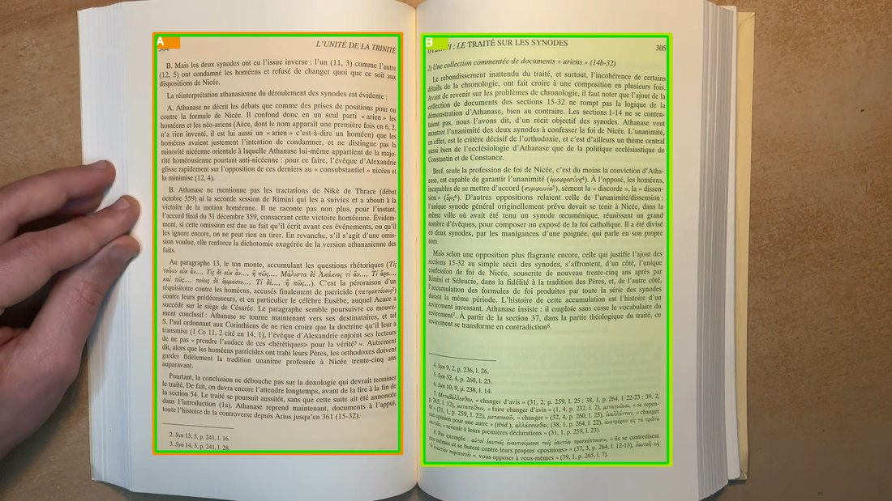
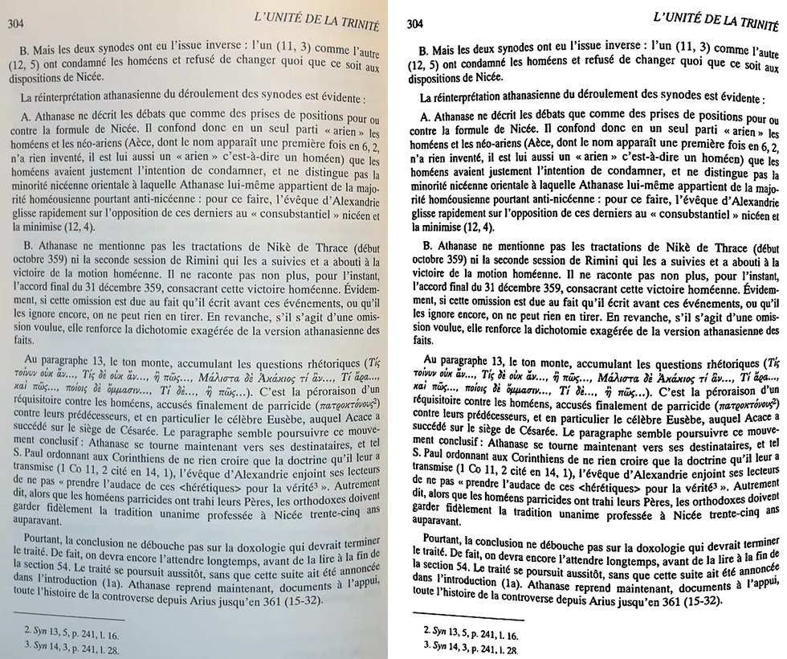
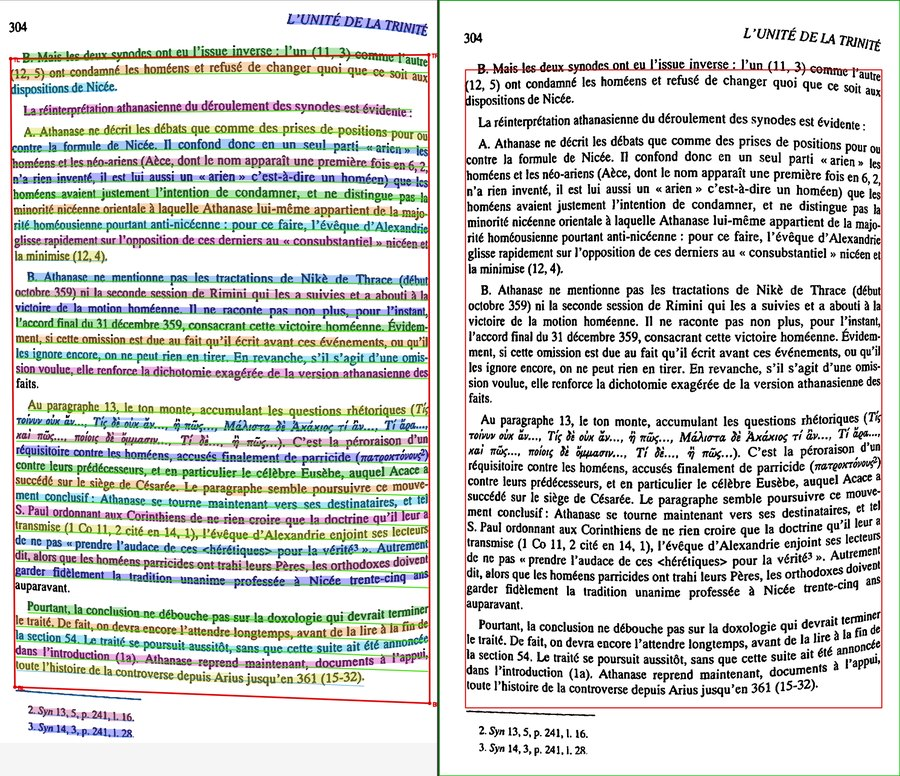
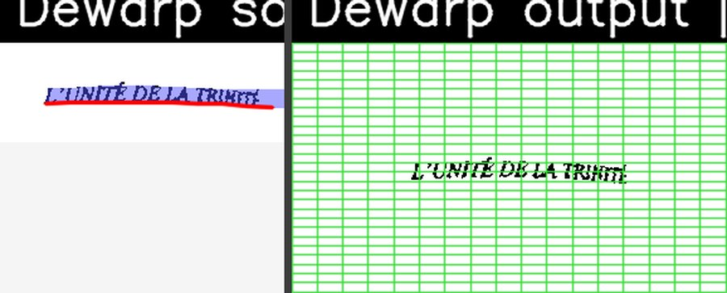

# Processors

All processors live in `aglaia/processors/`. Each has:

- A `*Option` dataclass extending `AbstractProcessorOption` (`aglaia/processors/abstraction.py`).
- A class extending `AbstractImageProcessor`.

## Processor contract (`AbstractImageProcessor`)

| Member | Required | Purpose |
|---|---|---|
| `SUMMARY: str` | yes (UI-exposed) | One-liner for the add-step menu. |
| `OPTIONS: dict[str, ParamSpec]` | yes (UI-exposed) | Option specs; the registry's discovery gate. |
| `REPLAY_TRAIT: ReplayTrait` | for replayable steps | `COORDINATE` / `PIXEL_VALUE` / `ROI` — drives the replay engine (see [pipeline.md](pipeline.md) → Replay pass). Also gates **per-page disable**: only COORDINATE/PIXEL_VALUE steps are toggleable; ROI / branch-emitting steps (e.g. PageDetector) are locked because skipping them would restructure the branch tree. A disabled step is bypassed with a passthrough node (see [storage.md](storage.md#per-page-processor-disable-step_overrides)). |
| `process(buffer) -> ImageBuffer \| list[ImageBuffer] \| None` | yes | The transform. Mutate `buffer` and return it; return a list (or set `buffer.children`) to branch; return `None` to stop the branch. |
| `replay(buffer)` | no | End-of-chain reconstruction. Default re-runs `process()`; geometric processors stamp `replay_kind`/`replay_params` so the engine fuses their warp instead. |
| `OPTION_CLASS` | no | Explicit options dataclass; default is synthesised from `OPTIONS`. |
| `REGISTRY_NAME` | no | Registry key; default is the class name. |
| `PROVIDES_META: dict[str, str]` | no | Documentary declaration of the `meta` keys this step stamps onto its output buffer (key → meaning), beyond the `replay_kind`/`replay_params` plumbing. Lets a downstream processor or plugin author discover what's available upstream, and feeds the generated reference. Declaring a key does **not** stamp it — the processor still writes `buffer.meta[key]` itself. |

The chain calls `run(buffer)`, which wraps `process()` and enforces the
output-format contract (`ImageBuffer`, list, or `None`). `__init_subclass__`
validates the contract at import (warns on a missing `SUMMARY`, or `OPTIONS`
keys with no matching option field).

### Common option fields

`AbstractProcessorOption` contributes only plumbing fields every processor
inherits: `debug` (bool), `debug_dir` (str?), `timeout_s` (float). They are
hidden from the parameter descriptions.

## DPIfixer (`aglaia/processors/DPIfixer.py`)

Clamp `ImageBuffer.dpi` into `[min_dpi, max_dpi]` via `cv2.resize`. `INTER_CUBIC` for upsampling, `INTER_AREA` for downsampling. Updates `meta["roi"]` (point coords scaled). No-op if change <1 dpi.

```yaml
options:
  min_dpi: 100
  max_dpi: 300
```

Use it both as **input clamp** (early) and **normalize** (e.g. force exactly 300dpi by setting both bounds equal).

## SkewFinder (`aglaia/processors/SkewFinder.py`)

Two-pass projection-profile deskew:

1. Downscale to 400px tall, then binarize (Otsu) — estimation only; the output buffer is untouched by this downscale.
2. Coarse search: ±`max_angle` in 1° steps. Score = `sum(diff(row_sums)^2)` on a sheared copy (rows align when angle matches).
3. Fine search: ±1° around best angle in `accuracy` steps.
4. If `apply_rotation` and `|angle| ≥ min_angle`, rotate via `cv2.warpAffine`. Border value = white for color, configurable via `k_cluster`.

Stored as `meta["skew"]`. `meta["roi"]` polygon is transformed by the same matrix.

```yaml
options:
  max_angle: 30.0      # Search range in degrees
  min_angle: 0.1       # Minimum angle to actually apply rotation
  accuracy: 0.1        # Fine-search step
  apply_rotation: true
  k_cluster: 0         # 0 = white background. >1 = k-means cluster count for bg color detection
```

`estimate_skew(image)` is a module-level helper used by `ImageBuffer.deskew`.

## LayoutBackend (text detection)

`aglaia/processors/layout_backends/` — pluggable abstraction picked via the `backend:` YAML option on `PageDetector`.

| Backend | Model | GPU |
|---|---|---|
| `apple_vision` | macOS Vision framework | Neural Engine / GPU automatic |
| `east` | `frozen_east_text_detection.pb` (~95 MB) in `./model/` or `./models/` | CUDA via `cv2.dnn` if OpenCV is CUDA-built |
| `dbnet` | PP-OCR det ONNX (v3/v4/v5) in `./model/` or `./models/` | same as above |
| `heuristic` | none | CPU only |
| `auto` | dbnet → apple_vision (macOS only) → east. Raises an error if no model is installed (no heuristic fallback). | inherits |

Each backend reports `uses_gpu`. The chain stamps `meta['gpu'] = True` on every node produced by a GPU-backed processor; the web UI then renders a 🚀 next to the step in the per-scan timing bar.

## PageDetector (`aglaia/processors/PageDetector.py`)

Apple Vision text detection → merge overlapping x-spans → optional reduce-to-N → emit child buffers.



1. Optionally downscale to `processing_dpi` for detection (defaults to no downscale).
2. The configured `LayoutBackend` (`auto` → `apple_vision` on macOS) `.detect(img)` returns bounding boxes.
3. `xy_cut(boxes)` groups the boxes into columns at vertical whitespace gutters wider than `gutter_min_frac`.
4. Contrast filter (`min_contrast`): drop a group whose ink range — `p95 − p5` of the pixels **under its detection boxes**, relative to the strongest group — falls below the threshold. That is what a bleed-through ghost looks like: pale where its ink is. Measured over the group's whole **bbox** instead, as it was until 2026-09, the metric is a density proxy — a sparse layout is mostly paper, so `p5` lands on paper too and the range collapses however black the ink. It deleted a title page, two chapter openings and two chronology date columns over the 141 spreads of one book, at 0.12–0.35, where the ink measure puts the worst page of that book at 0.68.
5. `smart_merge` folds over-split groups back together, scored by the `merge_*` weights. If `max_pages > 0` and the count still exceeds it, the `over_cap` strategy reduces the surplus: `"merge"` folds the best-scoring pair together (default), while `"discard"` drops the smallest page. Single-page modes (`sheet`, `book_flat_x1`) use `over_cap: discard` so marginal text bleeding in from a facing page is thrown away rather than merged into the kept page. Genuine over-splits scoring ≥ `merge_threshold` always merge regardless of strategy.
6. Tighten each page horizontally (`tighten_x`): walk in from each extreme and stop at the first step below 10% of the page width, so a cable, a hand or the edge of a cup is dropped. **On a two-page spread the spine side stands down** — it is bounded by the crease instead, taken as the midpoint of the gutter between the two page rects. The gap test cannot tell an intruder from a legitimate element that stands alone, and it was eating text: a lone date in a chronology column, and the two longest lines of a short ragged block (#86). An intruder comes from outside the book, never from the gutter, so the side is the discriminator. Single-page captures have no crease and keep the test on both sides.
7. Extend each page vertically into a `margin_mm` band to pick up a running head above or a page number below the body rect.
8. For each page, crop the original image with `margin_mm` margin, build a child `ImageBuffer`. Intersect the parent's `meta["roi"]` polygon with the child ROI via `cv2.intersectConvexConvex` and propagate the result.
9. The child ROI — the region the downstream `Binarizer` KEEPS, everything outside it is erased — is the page's text boxes dilated by `roi_margin_mm`. With `roi_hull` (default) that's their **convex hull**; with it off, their axis-aligned bounding rect. Prefer the hull on any capture that isn't shot square-on: a text block photographed at an angle has its corners well outside the printed area, and that is exactly where the fingers holding the book, or the facing page, appear. Dilation is exact — every box is grown by the pad and the corners re-hulled, which is `hull(boxes) ⊕ square(pad)` — so no vertex is under-padded and a sharp corner can't blow up the way a miter offset would. The hull is always a subset of the padded bbox, so turning it on can only tighten the ROI.
10. Returns `input_buf.children` (list of buffers). The chain re-injects each child into the pipeline starting at the next step and prunes the parent file from output.

```yaml
options:
  margin_mm: 2.0           # crop margin around each page bbox
  roi_margin_mm: 4.0       # ROI padding for the Binarizer; raise if margins clip
  roi_hull: true           # ROI = convex hull of the text boxes (false = bbox)
  max_pages: 2           # 0 = infinity
  over_cap: merge          # over-cap reduction: merge | discard (drop smallest)
  processing_dpi: 150.0    # null = no downscale
  rescale_threshold: 0.01
  merge_threshold: 0.60    # column-merge score cutoff
  merge_gap_weight: 0.4    # gap term weight in the merge score
  merge_width_weight: 0.6  # width-similarity term weight
  merge_gap_norm_cap: 0.15 # cap on the normalized inter-box gap
```

The default `auto` backend resolves **dbnet → apple_vision (macOS) → east**. The projection-profile `heuristic` is no longer an `auto` fallback — `auto` raises `LayoutModelUnavailable` if no ML model is installed (download one with `aglaia setup` or the in-app downloader); pick `heuristic` explicitly to use it.

## Binarizer (`aglaia/processors/Binarizer.py`)



Local adaptive thresholds (Wolf/Sauvola/…) compute a per-window cutoff, so a
shadow or lighting gradient across the page doesn't swallow text the way a
single global threshold would.

Dispatcher with four modes:

- `NONE` — pass through.
- `GRAY` — convert to grayscale (no thresholding).
- DOXA — any algorithm name from `doxapy.Binarization.Algorithms` (e.g. `WOLF`, `SAUVOLA`, `NIBLACK`, `BERNSEN`, `BHT`, `BRADLEY_ROTH`, `OTSU`). Family-specific params (`window_mm_<family>`, `window_px_<family>`, `k_<family>`) go through `doxapy.Binarization.to_binary(binary, params)`.

```yaml
options:
  method: "wolf++"
  window_mm_wolf: 3.2    # Wolf window in mm; each family has its own window_mm_<family>/k_<family>
  k_wolf: 0.5            # Threshold bias for the wolf family
  roi_shrink: 5          # Erode meta['roi'] mask N×, force out-of-ROI pixels white
  morpho_close: 2        # Morphological close (0–10) after threshold
```

ROI masking (`_apply_roi_mask`): if the input buffer carries a `meta["roi"]` polygon (set by SkewFinder / PageDetector), pixels outside the polygon are forced to white after binarization. `roi_shrink` is the number of `cv2.erode` iterations applied to the mask first.

BW inputs are a no-op (pass-through).

## TrapezoidalCorrection (`aglaia/processors/TrapezoidalCorrection.py`)

Keystone (pure perspective) rectification: text-line baselines → vanishing point (RANSAC + TLS) → column quadrilateral → Zhang-He metric aspect recovery → single `cv2.warpPerspective`.

All detection (binarize, connected components, morphology, span assembly, baselines, quad) runs at `processing_dpi` (default 150 — same convention as PageDewarper/PageDetector); the 4 quad corners scale back exactly and only the final warp touches the full-res buffer. Stamps `replay_kind: "perspective"` with the full 3×3 homography for the replay pass.



A **manual column quad** (`manual_overrides.quad`, M9) replaces the whole detection: the baselines, the vanishing point and the edge clustering are what is being overridden, so none of them runs and the `min_line_count` guard — which exists to protect that detection — does not apply. The four points arrive in the step's input coordinates; a non-convex quad is still refused (it has no valid homography and the warp would fold the page over itself), while the area floor is skipped because the size is the user's call. Both paths land through `_rectify`, so a corrected page differs from an estimated one by its four corners and nothing else.

```yaml
options:
  line_source: connectivity   # connectivity | meta (PageDetector boxes)
  min_line_count: 4
  processing_dpi: 150.0       # analysis resolution; final warp is full-res
  ransac_trials: 200
  margin_mm: 2.0
  zhang_he_min_skew: 0.05     # skip metric upgrade on near-axis-aligned quads
```

Falls back to passthrough (`Status.REVIEW`) when too few baselines or the quad fails convexity/area/aspect sanity checks.

### Spine-aware estimation (`spine_aware`, default off)

Near the binding the page curls out of plane, so the bottom-most ink sits
progressively lower than the true baseline. That is evidence which is
systematically *wrong*, not merely noisy, and an unweighted fit lets it tilt
the line and drag the vanishing point. Knowing which edge carries the fold —
the `page_side` meta PageDetector stamps on a spread, which survives this step
since 2026-08 — allows three corrections:

1. **Curl-zone down-weighting.** Column weights ramp from a 0.25 floor at the
   fold to 1 outside the innermost 30% of page width. The RANSAC inlier band
   scales with the weight (curl-displaced bottoms fall out more easily),
   candidates score by weight sum, and the refit is weighted least squares.
   Measured on a synthetic line, this cuts the curl-induced baseline tilt by
   **57-69%** across sag strengths of 12-30 px.
2. **Fold-side cluster bandwidth ×2.** Only that edge — its endpoints wobble
   with the curl and would otherwise splinter into clusters below
   `min_support`.
3. **A well-supported tilt disagreement is kept.** With curl-weighted
   baselines both edges are genuine evidence, so a disagreement backed by
   ≥ max(6, half the members) on both sides is real keystone convergence, not
   one side locking onto a slanted minority. When one edge *is* weak, the fold
   side arbitrates (curl corrupts it by construction) rather than member count.

`spine_aware: false` gives the exact side-agnostic behaviour, and the option
is inert on single-page scans (no `page_side` to resolve).

> **Off by default, on the corpus evidence.** It was briefly enabled and then
> reverted. On the 12 fixture pages: mean 0.926 → 0.929 px, median
> 0.879 → 0.897 (worse, ~9× the noise floor), worst page 1.206 → 1.128
> (better). More tellingly the per-page benefit correlates **+0.275** with
> page curl — the *opposite* of the mechanism's premise, with low-curl pages
> gaining (−0.024 mean) and high-curl pages losing (+0.031).
>
> It is kept rather than removed because the two measurements genuinely
> disagree and the direct one is strong: −57 to −69% curl-induced baseline
> tilt on synthetic sag, plus the iOS port's device validation on **handheld**
> captures. The fixture corpus is rig captures — a different curl regime, and
> the most plausible reconciliation, though that is a hypothesis rather than
> something measured here. **Turn it on for handheld or strongly-curled
> material**, where the corpus above says nothing useful either way.

## PageDewarper (`aglaia/processors/PageDewarper.py`)

**Dewarping** removes the curvature + perspective that make a photographed
book page look bowed: near the spine the page curves and tilts, so every text
line bends into a banana shape a single deskew rotation cannot undo.
PageDewarper fits a 3-D *sheet* model to the detected text baselines and
re-projects it flat, recovering straight lines. The chain runs deskew first
(cheap global tilt), then dewarp for the residual curvature.



| | Deskew | Dewarp |
|---|---|---|
| Model | single rotation angle | 3-D cylindrical sheet (cubic + spine curl) |
| Fixes | whole-page tilt | curvature **and** perspective |
| Cost | cheap | optimisation (LM; MLX / JAX / Powell available) |
| When | flat sheets, light skew | bound books, curled pages |

Sheet-model dewarping built on the `page-dewarp` library. Optimizer backend
(`backend: auto`) resolves to **LM**.

### Optimizer backends

| backend | what it is | models | notes |
|---|---|---|---|
| `lm` | Levenberg-Marquardt, analytic Jacobians, Schur complement over per-span *arrowhead* blocks (`aglaia/processors/lm_solver.py`) | cylindrical | CPU, no GPU pool to babysit. ~10-60 iterations replace Powell's 10⁴-10⁵ objective evaluations — measured 28 s → 0.25 s per page on the test fixture at a *better* final objective. The only backend carrying the camera upgrades below. |
| `mlx` | MLX value+grad, Apple Metal | cylindrical | Needs `clear_pool()` between pages (unified-memory allocator). |
| `jax` | padded JAX L-BFGS-B (fixed shapes, batchable) | cylindrical | Unresolved host-pool growth on Apple silicon; prefer MLX. The CUDA build batches through it. |
| `powell` | SciPy Powell, derivative-free | cylindrical | Reference oracle. Slowest by ~100×. |

The LM problem is bipartite: 8 (or 10) *global* camera params against S span
heights `y_i` and N per-keypoint abscissae `x_ij`. Points in a span share only
`y_i`, so each local Hessian block is an **arrowhead** matrix eliminated in
O(nᵢ) by Sherman-Morrison; the Schur complement leaves one `n_cam × n_cam`
solve per iteration. Env override `AGLAIA_DEWARP_LM=0` keeps `auto` on the
pre-#59 GPU chain.

### Camera and objective upgrades (LM only)

Three findings from the iOS port's on-device debugging (issue #60), all
cylindrical + LM only — the MLX/JAX/Powell objectives are the plain centred
pinhole, so these options are forced off on those backends:

- **`principal_point`** (default on) — fit (cx, cy) alongside the pose, camera
  block 8 → 10. A homography composed with a perspective view of a *curled*
  page is a general projective camera; the centred square-pixel pinhole cannot
  represent it, which is why the fit under-curls near the spine after
  `TrapezoidalCorrection`. Measured on the fixture page: output line curvature
  1.77 → 0.98 px.
- **`spine_weight_boost` / `spine_weight_zone`** (default 4 over the
  spine-side 25%) — the binding-side tail is a least-squares minority, so an
  unweighted fit systematically under-curls there (2-4 px at 300 dpi). Weights
  ramp from `boost` AT the binding to 1 at the far edge of the zone. Needs a
  resolvable binding side (see `binding_side`); off otherwise.
- **`spine_gammas` / `spine_gamma_scale`** — grid search over a
  spine-localized directrix term `z += γ·exp(−|x − x_binding| / s)`, each
  candidate fitted and the best objective kept. γ = 0 (the plain cubic) always
  competes, so the grid can only improve the fit. Only identifiable *with*
  the principal point — under the 8-param camera the composed-camera offset is
  absorbed into curl and masks the basis term. Also fixes horizontal
  compression at the fold: output x-scale comes solely from ∫√(1+z′²)dx, so an
  under-sloped surface under-allocates arc length exactly there. Both signs of
  each γ are tried (the physical curl direction is not fixed across corpora).

`binding_side: auto` reads the `page_side` meta the PageDetector stamps on
two-page spreads; single-page scans need it set explicitly or the spine
features stay off for that page. That meta has to *survive* the intervening
steps — `TrapezoidalCorrection` returns a fresh `ImageBuffer` and dropped it
until 2026-08, which silently disabled the spine features **and**
flat_spline's binding-side flip/penalty **and** the per-side warm-start ring
for every page in the default pipeline. Anything added to that path must
forward `_CARRIED_META`.

**Measured on `book_curved_x2` over the full fixture corpus (`test_athanase`,
`test_augustin`, `test_balthasar` — 6 spreads → 12 pages), mean deviation of
the output text baselines from a straight line:**

| sheet model | solver | mean | worst page | ms/page |
|---|---|---|---|---|
| **cylindrical + spine curl** | **LM, 10-param** | **0.923 px** | **1.194** | 659 |
| cylindrical (γ off) | LM, 10-param | 0.960 px | 1.345 | 236 |
| flat_spline | MLX | 1.679 px | 3.315 | 553 |
| bspline_twist | MLX | 1.648 px | 3.053 | 635 |
| sine_twist | MLX | 1.645 px | 3.051 | 681 |

Measured with `slope_emphasis: 0`; the shipped default of 1 scores 0.926 px,
inside the noise floor (that option changes horizontal scale, which this
vertical metric cannot see — see below).

The cylindrical + spine-curl model wins on **every one of the 12 pages**. Most
of that margin is the LM solver and the principal point (an 8-param Powell fit
of the same model scores 2.04 px); the γ term itself adds a further ~4% on the
mean and ~11% on the worst page, for ~3× the fit time (the grid is 6 extra LM
fits). The twist family never wins on any page.

### Slope-based x decompression (`slope_emphasis`, default 0)

The arc-length grid corrects the **surface-length** term: paper is
inextensible, so sampling uniformly in x stretches text by √(1+z′²) where the
sheet is steep. It does *not* correct **projective foreshortening** — where the
page recedes steeply near the spine the camera sees those glyphs compressed
however the surface is parameterised, and arc length alone gives them no extra
output pixels.

`slope_emphasis` (k) weights the grid measure by `(1 + z′²)^(k/2)`, so steep
regions claim proportionally more output width. z′ is recovered per segment
from the measure itself (`ds/dx = √(1+z′²)`), so it needs no model derivative.
**k = 0 reproduces the arc-length grid exactly** — the path every
already-stamped project replays through — and the value is carried in the
replay stamp so a replayed page is sized like the live one.

**When it matters.** The weight is `(1 + z′²)^(k/2)`, so the effect scales
with the *square* of the sheet slope — negligible on a mildly curled page,
substantial on a strongly curled one. Measured at k = 1 (output width, and the
share of output columns landing in the steepest quarter of page-x):

| max \|z′\| | width k=0 → k=1 | steep-quarter share |
|---|---|---|
| 0.10 | +0.3% | 0.251 → 0.251 |
| 0.25 | +0.5% | 0.252 → 0.253 |
| 0.50 | +1.5% | 0.256 → 0.262 |
| 1.67 | **+16.9%** | 0.318 → **0.403** |

**Default k = 1**, matching the iOS port, where it is device-validated on real
captures. Be clear about what backs that: it is device validation there plus
the maintainer's judgement on his own scans — **not** a local measurement. The
A/B harness scores *baseline straightness*, a vertical property, and this
changes only horizontal scale, so the harness is structurally blind to it. What
the harness can say is that it does not regress: k = 1 over the corpus scores
0.926 px against k = 0's 0.923, at the run-to-run noise floor (~0.002 px, see
`docs/development.md`). The fixture corpus also fits mild curl, where the table
above puts the effect under 1% — so a null result there is what the mechanism
predicts, not evidence either way.

Set `slope_emphasis: 0` to recover the exact pre-#70 arc-length geometry.
Projects stamped before this option carry no key and replay at 0 regardless of
the current default — they render exactly as they were fitted.

### Failure ladder

A fit is judged by the `max_oob` gate on its remap, not by its objective — the
objective cannot see a wild remap. On one fixture page γ = −0.10 (the grid
edge) scored *below* γ = 0 while overshooting the gate. A rejected fit walks
down, cheapest rung first:

| rung | what | cost | why it can fail |
|---|---|---|---|
| 1 | LM fit, γ grid searched | ~660 ms | the γ grid can select a wild surface |
| 2 | diverged `page_dims` → rough dims, let the gate judge | free | — |
| 3 | re-fit with the γ grid off (plain cubic) | ~125 ms | the curl itself can run away |
| 4 | re-fit with the **curl frozen at 0** — pose and page dims around a flat sheet | ~6 ms | cannot: a zero-curl surface has no runaway remap |
| 5 | grayscale passthrough, `Status.ERROR` | — | — |

Rung 4 gives a page that is perspective- and pose-corrected but **not**
curl-corrected — worse than a good fit, much better than a grey one. It is
also the only rung that answers the *other* documented failure: LM parking a
shape DOF on the ±0.5 curl clamp at a competitive objective but a wild remap.
It is dormant on healthy pages (0 firings across the 12-page corpus) and its
result is deliberately **not** recorded in the warm-start ring — a curl of 0 by
construction is not a measurement, and seeding the next page with it would
propagate one page's failure.

**LM with the plain 8-param camera is not uniformly better than Powell**,
even though it reaches an equal-or-better objective.
The objective has a near-flat curl/pose valley and LM occasionally parks a
shape DOF ON the ±0.5 curl clamp — same objective as the sane region, wild
remap (reproduced here: α = −0.503 on one page). The principal-point DOF
removes the degeneracy, which is why it is on by default. If you turn
`principal_point` off, expect the pre-#60 quality band, not the numbers above.

> The iOS port retries a rejected fit on Powell, which is right where Powell
> costs ~540 ms. On the desktop it is 25-80 s per page — 200× the γ back-off
> for the same recovery — and until #64 the chain dropped a page whose step
> outlived the run, so the Powell retry lost the very page it was meant to
> save. Rungs 3 and 4 are the desktop equivalent, at 125 ms and 6 ms.

### The sheet model

One model: the **cylindrical** sheet `z(x) = (α+β)x³ − (2α+β)x² + αx` — a
generalised cylinder, every horizontal slice sharing one height profile — plus
the optional spine-curl term above.

The twist/spline family (`sine_twist`, `bspline_twist`, `flat_spline`:
Fourier-sine and clamped cubic B-spline profiles modulated by a linear-in-y
twist gain) was **retired in 2026-08**. They were strictly more expressive on
parameter count and strictly worse on results — see the table below, where the
cylindrical + spine-curl model wins on every page. A fold concentrates
curvature at the spine, which one localized term captures robustly, while the
global spline families spread degrees of freedom where there is no curvature,
overfit noisy spans more easily, and are harder to optimise.

This is a **hard break**: a `.agl` node stamped with one of those models raises
on replay (`sheet_models.canonical_model`) rather than being rebuilt against a
different surface — re-process such a page from source. Do not reintroduce them
without beating 0.923 px on the same corpus.

Pipeline:

1. Pad input by `dewarp_margin` mm with white border.
2. Downscale to `processing_dpi` (default 150) for span analysis; the remap reads full-res pixels.
3. Build a text mask (mm-sized MORPH_CLOSE, char-scale adaptive); assemble spans; fall back to line-mask morphology if <3 text spans.
4. Sample span curves via robust span-level fits (`fit_span_baseline`: IRLS Tukey cubic over each text line's ink profile — descenders/dashes rejected by the loss, keypoints reach line ends). `baseline_source` selects what feeds the model: `bottom` (baselines), `top` (x-height toplines), `average` (midlines), or `both` (default — baseline + topline as separate spans, doubling vertical constraints). Toplines are validated to sit 0.3–2.5 x-heights above the baseline.
5. Optimize the sheet + per-span/per-point coords. With `use_huber` (default on) the reprojection loss is pseudo-Huber (`huber_delta`, normalized units) on the LM (via IRLS — the Gauss-Newton weight `1/√(1+r²/δ²)` recomputed each Jacobian pass) and MLX/padded-JAX backends — stray spans (footers, captions) can't drag the sheet. `cubic_cost` regularizes the shape params against phantom curl on flat input (α/β L2 for cylindrical; bending energy for the twist models: Σ(k²c_k)² for sine_twist, second differences of the control polygon for bspline_twist — γ unpenalised). The whole geometry path (solvePnP init, optimise, page dims, remap) runs under the configured `focal_length`.
6. Remap with an **arc-length-uniform x grid** (`sheet_models.arclength_x`, mid-row profile): output width sized from the sheet's arc length, so text near the steep gutter side keeps its true width instead of stretching by √(1+z′²). One function builds that grid — `PageDewarper._sample_grid`, shared by the live remap, by replay (`_replay_sample_map`) and by the debug overlay (`storage/debug_renderers.dewarp_grid_lattice`), so all three describe the same surface. Replay params carry `page_dims` / `focal_length` / `zoom` / `decimate` / `pad_px` / `src_shape` / `slope_emphasis`, plus `camera_np` (8, or 10 when pvec[8:10] is the fitted principal point) and `spine` (the winning `SpineCurl`, or null). Those last two are load-bearing: the sampling grid derives from them, so a consumer that ignores either draws — or remaps — a different sheet. Pre-#60 stamps carry neither and default to the 8-param pinhole with no spine term, exactly the surface they were fitted on.
7. **Output size** comes from `page_dims`, which lives in `norm2pix` units — scale `0.5 · max(h, w)` of the *padded* input. So the output height is measured against the longer reference side, never against `ref_h`: upstream page-dewarp used `img.shape[0]` there, which is the same number only on a portrait crop. On a landscape one (a chapter opening, a part-title, any short page whose text block is wider than tall) that scaled the whole remap by `ref_h / ref_w` while the node stayed stamped 300 dpi — a 1289×533 page landed at 520×224. Portrait crops are unaffected, so already-stamped projects replay to the size they have today.
8. Sanity check: if remap goes out of bounds by more than `max_oob` px, abandon dewarp and return grayscale of padded input (`Status.ERROR`). Span-count guard (`min_spans`) passes through with `Status.WARNING` instead of running an under-constrained fit. **`manual_overrides.force` (M9) runs past both.** They are right by default and sometimes wrong — a sparse page whose few spans are perfectly good, a wide fit the gate reads as runaway. Forcing is per page, never a default, and stamped (`manual: force`, plus `oob_forced` when the gate was the thing overridden) so a bad page stays explainable.

```yaml
options:
  backend: auto                 # auto | lm | mlx | jax | powell
  principal_point: true         # LM: fit (cx, cy) — the keystone-composed camera
  spine_weight_boost: 4.0       # LM: residual weight at the binding (1 = off)
  spine_weight_zone: 0.25       # LM: width of the up-weighted spine zone
  spine_gammas: 0.02, 0.05, 0.10  # LM: spine-curl γ grid ("" = off)
  spine_gamma_scale: 0.15       # LM: spine-curl decay length, fraction of page width
  binding_side: auto            # LM spine features: auto | left | right
  baseline_source: both         # bottom | top | average | both
  use_huber: true               # robust pseudo-Huber reprojection loss
  huber_delta: 0.005            # pseudo-Huber scale (when use_huber)
  max_oob: 400.0
  page_margin_mm: 5.0
  dewarp_margin: 5.0
  remap_decimate: 4
  shear_cost: 40.0
  cubic_cost: 0.0               # shape regularizer (α/β or spline bending); 0 = off
  focal_length: 1.3             # Overridden by camera calibration if loaded
  processing_dpi: 150.0         # Span analysis downscale
  min_spans: 3
  min_span_width_ratio: 0.5     # drop partial-width spans (footers, page numbers)
  kernel_char_mult: 2.0
  thickness_char_mult: 3.0
  edge_max_length_char_mult: 3.0
  line_join_mm: 4.0             # fallback kernel when char scale unknown
```

When `debug: true` or `--debug`, writes intermediate visualizations to `<workspace>/debug/`:

- `<stem>_0_spans.jpg` — colored span overlays.
- `<stem>_1_initial.jpg` — keypoint projection from initial params (side-by-side with input).
- `<stem>_2_optimized.jpg` — initial vs. optimized keypoint projection.

JAX cache lives at `./.jax_cache/` (auto-created). Persisting compilation across runs saves ~5s startup.

## MarginSetter (`aglaia/processors/MarginSetter.py`)

The last step of every shipped pipeline (`output_margin`). It **crops to the
ink content**, then pads a white border — so the margin is measured from the
text, not from whatever canvas the previous step left behind. `margin_mm`
takes a CSS-style shorthand (`"2"` all round, `"2 6"` V H, `"2 6 3 4"` L R T B);
`margin_px` overrides it in pixels. All four shipped pipelines ask for **2 mm**,
which is also the bare default.

`width_floor` (advanced, **off**) pads the page back out to the step's input
width when the crop came out narrower. Physically the floor is defensible —
flattening a curved page can only grow its width, and an earlier fix for that
up-scaled the image and squished glyphs — but the promise is about *page*
width, while this step's contract is content-crop plus a stated margin.
Horizontally it therefore re-adds exactly the whitespace the crop removed, and
the margin stops being the one you set: over 40 real pages asking for 5 mm,
top and bottom came out exactly 5.0 mm while left and right ranged 10.2-16.8 mm
and varied page to page (#112). Turn it on only when every page must stay at
least as wide as the dewarp made it.

The forward pass stamps `min_width_px` (0 = no floor) so `apply_replay`
reproduces it exactly; a chain stamped before the option existed carries the
old unconditional value and still replays as it ran.

Note the ROI margins never reach the output: because this step crops to ink,
`PageDetector.roi_margin_mm` and the hull ROI govern what the Binarizer keeps,
not what the final page measures.

## Apple Vision detection (`aglaia/processors/layout_backends/apple_vision.py`)

`AppleVisionBackend` is the `apple_vision` `LayoutBackend` used by
PageDetector for text-box detection:

- `detect(img_rgb)` — returns the list of bounding boxes (no text).

It uses `VNRecognizeTextRequest` with `RecognitionLevelAccurate` and language
correction disabled, wrapped in `objc.autorelease_pool` to keep memory bounded.
Text *recognition* for OCR is a separate concern — the `apple_vision` /
`apple_docs` OCR engines live under `aglaia/workers/ocr/` (see [OCR](ocr.md)).

## Writing a new processor

1. Add a file in `aglaia/processors/`.
2. Define an option dataclass:

```python
from dataclasses import dataclass
from aglaia.processors.abstraction import AbstractProcessorOption, AbstractImageProcessor
from aglaia.ImageBuffer import ImageBuffer

@dataclass
class MyOption(AbstractProcessorOption):
    threshold: int = 42
```

3. Define the processor:

```python
from aglaia.processors.abstraction import ReplayTrait
from aglaia.processors.option_specs import _i

class MyProcessor(AbstractImageProcessor):
    name: str = "MyProcessor"
    SUMMARY = "One-line description for the add-step menu."
    OPTIONS = {"threshold": _i(42, 0, 255, "Threshold value.")}
    OPTION_CLASS = MyOption
    REPLAY_TRAIT = ReplayTrait.PIXEL_VALUE   # omit if the step isn't replayable
    def __init__(self, options: MyOption):
        super().__init__(options)
        self.threshold = options.threshold
    def process(self, buf: ImageBuffer) -> ImageBuffer:
        # mutate buf.buffer / buf.meta / set buf.children
        return buf
```

4. **Nothing to register.** `aglaia/processors/registry.py` auto-discovers
   the class on first access — it scans `aglaia/processors/*.py` for
   `AbstractImageProcessor` subclasses that declare `OPTIONS`. The GUI
   add-step menu, the pipeline loader (`Initializer`), and the worker
   chain (`IntegratedProcessingChain`) all read through the registry; no
   `OPTION_MAP` / `PROCESSOR_REGISTRY` edits, no `if name == "X"`
   branches. (To extend without touching the repo, drop the file in
   `<APP_DATA>/plugins/processors/` and approve it in the trust prompt.)

5. Reference it in a pipeline YAML by its registered name — `REGISTRY_NAME`
   if set, else the class name (case-sensitive).

Return semantics:

- Return the same buffer → chain continues with that buffer.
- Set `buffer.children = [child1, child2, ...]` (or return a list) → chain branches; each child re-enters at the next step.
- Return `None` → branch stops, warning logged.

## Drop-in user plugins (no repo edit)

Users add processors (and OCR engines) without modifying the repo by
dropping a `*.py` file into the per-user plugin dirs:

```
<APP_DATA>/plugins/processors/   AbstractImageProcessor subclass (SUMMARY + OPTIONS)
<APP_DATA>/plugins/ocr/          OcrEngine subclass decorated @register
```

(`<APP_DATA>` = `aglaia/app_data.plugins_dir()`; on macOS
`~/Library/Application Support/Aglaia/plugins/…`.)

**Trust gate.** Code is not run blindly. At GUI startup
`aglaia/gui/plugin_trust.py` (wired in `aglaia/app.py:_qt_app`) shows a warning
for every file that is new or whose content changed since it was
accepted, offering **Add / Delete / Skip**. Accepted files are recorded
in the `plugins` table of `aglaia-config.db` with a sha256.

**Invariant — import == code execution.** Discovery
(`aglaia.app_data.plugins.import_accepted()`, called by the processor
registry and `aglaia/workers/ocr/__init__.py`) imports *only* accepted,
sha-matching files; an unacknowledged or modified file is never imported.
Plugin dirs are placed on `sys.path` so a plugin's module name resolves
identically inside spawned pipeline workers (spawn re-imports by name).

**Headless/CLI** has no popup — it loads only already-accepted plugins
and prints a "pending" warning for the rest. Acknowledge them once via
the GUI.

> Threat model: stop a user from blindly running a file he dropped (or
> that something dropped for him). It is *not* a defense against an
> attacker with write access to the data dir — hence no signing.

**Worked example.** `examples/plugins/processors/ExemplePluginDespeckler.py`
is a complete, heavily-commented drop-in processor shipped for reference. It
demonstrates the whole contract in one file: declaring `OPTIONS` /
`OPTION_CLASS`, **consuming upstream metadata** (`meta["char_h_frac"]`),
**joining the replay pass** as a `PIXEL_VALUE` step via `apply_replay()`, and
**declaring** `PROVIDES_META`. Copy it into `<APP_DATA>/plugins/processors/`
and accept it in the trust prompt to try it live.

### Shared cross-step metadata: `char_h_frac`

`TrapezoidalCorrection` and `PageDewarper` both estimate the median glyph
height while detecting text lines. They stamp it as
`meta["char_h_frac"]` — glyph height ÷ page height, dimensionless, so it
survives any later resample/warp (a consumer multiplies by *its own* image
height to get pixels). Absent if fewer than ~30 char-like components were
found. This is the canonical "text scale" hint for downstream steps (e.g. a
despeckler sizing its speckle threshold) that would otherwise recompute it.
