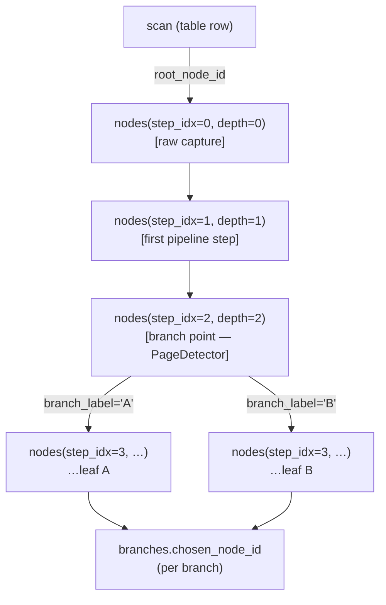

# Storage layer

Single SQLite file per project: `<workspace>/<slug>.agl`.

`journal_mode = DELETE` (a rollback journal that exists only during a write, leaving no `-wal`/`-shm` siblings), `synchronous = NORMAL`, `foreign_keys = ON`, and a 5 s `busy_timeout`. One writer at a time; each worker process holds its own connection (opened lazily on first message) and serializes on the busy-timeout.

## Module map

```
aglaia/storage/
  __init__.py          re-exports
  db.py                open_db / ensure_schema / PRAGMAs
  schema/0001_initial.sql … 0010_step_overrides.sql   (applied in order)
  repo.py              ProjectRepo / PipelineRepo / CalibrationRepo /
                       ImageRepo / ThumbRepo / ScanRepo / NodeRepo /
                       BranchRepo / OcrRepo / DebugRepo
  persister.py         encode_image / make_thumb / Persister
```

## Tables (overview)

| Table | Purpose |
|---|---|
| `project` | Singleton: name, slug, schema_version, notes. |
| `pipeline_versions` | Frozen YAML snapshots. Active row is current pipeline. Reproducibility. |
| `calibrations` | Frozen camera-calibration snapshots. Active row is current. |
| `images` | Encoded JPG/PNG blob + width/height/dpi/type. sha256-deduped. |
| `thumbs` | Per-image rasterized thumbnail (one per `max_dim`, e.g. 256). |
| `scans` | One row per capture root (webcam frame or PDF page). Soft-delete via `deleted_at`. |
| `nodes` | One row per pipeline-step output. Self-FK forms a tree. |
| `branches` | One row per terminal branch. `chosen_node_id` (the export node) now always tracks `terminal_node_id` — per-page output is shaped by `step_overrides`, not by moving the chosen node. Soft-delete via `trashed_at`. |
| `step_overrides` | Per-page-layout processor disable. A row `(scan_id, branch_path, step_idx, disabled)` makes the chain bypass that step for that layout. |
| `ocr_runs` | One row per OCR pass over a branch: engine, languages, status, `result_json`, timestamps. `is_stale` flags a result that no longer matches the branch's current node. |
| `debug_artifacts` | Optional debug images attached to a node (e.g. PageDewarper span overlays). |

## Node tree shape



Invariants:
- `step_idx=0` is the raw root for every scan.
- `parent_id IS NULL` only for raw roots.
- `branch_label` is set only on nodes that are the *direct output of a branch-emitting processor* (e.g. PageDetector). Linear-step nodes inherit their owning branch context implicitly via ancestry.
- `is_leaf` maintained by trigger `nodes_set_parent_not_leaf`.
- `is_branch_point` flipped to 1 when a child node is inserted under it AND the parent has >1 children (marked explicitly by the chain worker).

## Branches table

A `branches` row exists per terminal branch:

| Column | Meaning |
|---|---|
| `scan_id` | Owning scan |
| `branch_path` | `""` if no split, otherwise `"A"`, `"B"`, `"A.1"`… |
| `terminal_node_id` | Deepest node reached by the original pipeline run |
| `chosen_node_id` | Which node represents this branch in exports/UI |
| `trashed_at` | Soft-delete timestamp; non-null hides the branch from the gallery/table/grid views (per-page trash, finer than scan-level `deleted_at`) |

Lifecycle:
- Pipeline finishes a branch → `BranchRepo.upsert(scan_id, branch_path, terminal)`. Both `terminal_node_id` and `chosen_node_id` set to the deepest node.
- User clicks "back arrow" → `step_back`. Moves `chosen_node_id` one node toward root. Refuses to cross a branch point with siblings.
- User clicks "forward arrow" → `step_forward`. Walks one node toward `terminal_node_id`.
- Reset → `chosen_node_id = terminal_node_id`.

Sibling branches are not affected by a peer branch's overrides.

> **Exit-stage navigation removed (issue #68).** The `step_back` /
> `step_forward` / `reset_to_leaf` walk over `chosen_node_id` was replaced by
> per-page processor disable. `chosen_node_id` is now set to the rerun
> terminal by `upsert` and never moved by the user, so the export queries
> (which join `chosen_node_id`) are unchanged.

## Per-page processor disable (`step_overrides`)

| Column | Meaning |
|---|---|
| `scan_id` | Owning capture |
| `branch_path` | `""` = pre-split trunk (applies to every layout); `"A"`/`"B"` = one PageDetector layout |
| `step_idx` | The `nodes.step_idx` of the step's output (so views map 1:1) |
| `disabled` | `1` = skip this step for this layout. Enabling deletes the row, so a missing row == enabled |

When `IntegratedProcessingChain.run_pipeline` reaches a disabled **toggleable**
step (REPLAY_TRAIT COORDINATE/PIXEL_VALUE — ROI / branch-emitting steps like
PageDetector are locked), it emits a **passthrough node** instead of running
the processor: same pixels, `meta.disabled = true`, **no** `replay_kind` stamp.
The node tree stays contiguous, downstream steps run on the un-transformed
image, and `Replay` naturally excludes the passthrough (nothing stamped).
Toggling a step writes the override then reruns the scan from raw
(`reprocess_active_scans(scan_ids={id})`); the worker re-applies the override
set per branch.

## Image + thumb dedup

Image bytes hashed (sha256). Re-inserting identical bytes returns the same `images.id`. Pipeline steps that are no-ops therefore don't bloat storage; the node row is cheap (~200 bytes), the image is shared.

Thumbs are keyed by `(image_id, max_dim)`. Default `max_dim=256` (JPEG q=80).

## PRAGMAs at open

```sql
PRAGMA journal_mode = DELETE;   -- journal only exists mid-transaction:
                                -- no permanent -journal/-wal/-shm sidecar
                                -- next to the .agl file
PRAGMA synchronous = NORMAL;
PRAGMA foreign_keys = ON;
PRAGMA temp_store = MEMORY;
PRAGMA cache_size = -64000;     -- 64 MiB
PRAGMA mmap_size = 268435456;   -- 256 MiB
PRAGMA busy_timeout = 5000;
```

## Query cookbook

```sql
-- 1. Full subtree for a scan
WITH RECURSIVE t(id) AS (
    SELECT id FROM nodes WHERE id = (SELECT root_node_id FROM scans WHERE id = ?)
    UNION ALL
    SELECT n.id FROM nodes n JOIN t ON n.parent_id = t.id
)
SELECT n.* FROM nodes n JOIN t ON n.id = t.id ORDER BY n.depth, n.id;

-- 2. Project export set (post-user-override)
SELECT b.id, b.branch_path, n.filestem, i.format, i.width, i.height
FROM branches b
JOIN nodes n  ON n.id = b.chosen_node_id
JOIN images i ON i.id = n.image_id
JOIN scans s  ON s.id = b.scan_id
WHERE s.deleted_at IS NULL
ORDER BY s.idx, b.branch_path;

-- 3. All nodes of a step
SELECT * FROM nodes WHERE step_name = '05_pages_bw';

-- 4. Re-run a branch from a node (delete subtree)
WITH RECURSIVE sub(id) AS (
    SELECT id FROM nodes WHERE id = ?
    UNION ALL
    SELECT n.id FROM nodes n JOIN sub ON n.parent_id = sub.id
)
DELETE FROM nodes WHERE id IN (SELECT id FROM sub) AND id != ?;
```

## Blob-size caveat

At ~5–15 MB per page × ~8 pipeline steps, multi-thousand-page projects can reach 50–100 GB. SQLite handles up to ~140 TB in theory but row-blob fetching past several GB starts to feel sluggish. If a real project crosses ~50 GB, consider an external blob store (path column on `images` plus filesystem-level storage).
