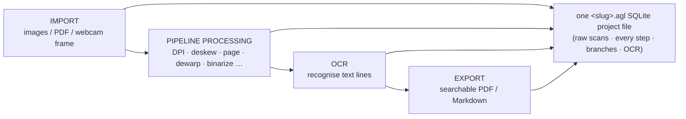

Aglaïa turns a stack of photographed or scanned book pages into a clean,
searchable document. Every page travels the same four-stage path, and the
whole journey is recorded in a single project file you can reopen, branch,
and replay.

## The four stages

1. **[Import](/docs/concepts/import)** — image files, PDF pages, or live
   webcam frames are ingested. Each one becomes a *raw scan* (the
   untouched source image) stored in the project.
2. **[Pipeline processing](/docs/concepts/pipeline-processing)** — every
   raw scan runs the ordered chain of *processors* defined by a pipeline
   YAML: DPI normalisation, deskew, page detection, page dewarp,
   binarisation, and so on. Each step's output is persisted, so the chain
   can branch (e.g. a two-page spread splits into two pages) and replay.
3. **[OCR](/docs/concepts/ocr-engines)** — an OCR engine reads the chosen
   output of each page into text lines (and, for some engines, structure
   such as headings and tables). This runs off the pipeline, on the image
   the user selected for each page.
4. **[Export](/docs/concepts/export)** — the chosen page outputs are
   assembled into a searchable PDF (image + invisible OCR text layer)
   and/or a Markdown document. You can also export a *slim* copy of the
   project itself.

## One file holds everything

All four stages read and write a single **[`.agl` project
file](/docs/concepts/agl-project-file)** — a plain SQLite database holding
the raw scans, every pipeline step, the branch choices, and the OCR
results. The same file (and the same pipeline) drives both the capture GUI
and headless CLI batches, so an interactive scan and a scripted run produce
identical results.

## Comparison: GUI vs headless

| | Capture GUI | Headless CLI |
|---|---|---|
| Entry | `aglaia.py <dir>` | `aglaia.py <inputs> --headless` |
| Import | live webcam + import panel | image / PDF / `.agl` arguments |
| Processing | identical `IntegratedProcessingChain` | identical |
| OCR / export | tabs + buttons | `--do-ocr` / `--export` flags |
| Use when | scanning interactively | batching, automation |

## Related resources

- [Import](/docs/concepts/import)
- [Pipeline processing](/docs/concepts/pipeline-processing)
- [OCR engines](/docs/concepts/ocr-engines)
- [Export](/docs/concepts/export)
- [The .AGL project file](/docs/concepts/agl-project-file)
